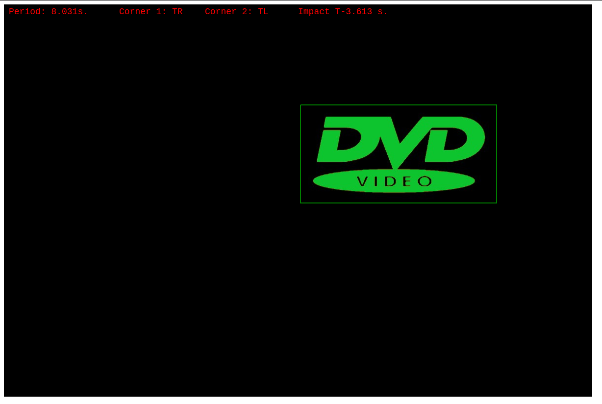

# dvd-logo-bounce-sim

Simulate the classic bouncing DVD Logo on a mock screen.

## Example

## Features

-   Calculates the period of corner-to-corner hit time
-   Calculate time remaining until a collision
-   Show what corner it will hit

## Credit

I discovered how to do this at [The Lost Math Lessons](https://lostmathlessons.blogspot.com/2016/03/bouncing-dvd-logo.html).

The code is based off of [this](http://prgreen.github.io/blog/2013/09/30/the-bouncing-dvd-logo-explained/).
